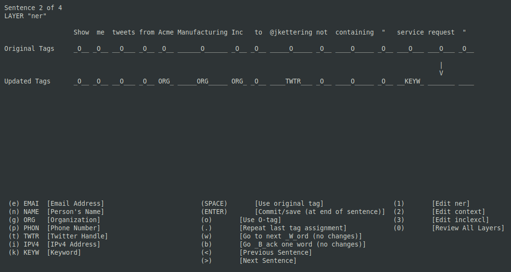
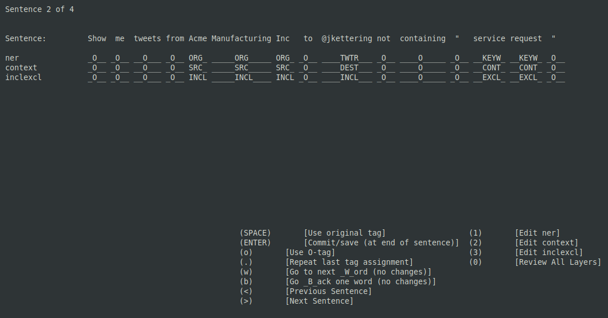

# Keyboard-Based Annotation Tool for NLP/NER Tasks
### A Weekend Adventure with the Ncurses Library

Something I threw together in a weekend (with subsequent tweaks) to help with rapid annotation of hundreds of sentences multiple times, each with a small set of tags/slots.  Annotating each word is a single hotkey keypress, allowing you to do all annotating without leaving the homekeys.  Once you have good mental mapping of the hotkeys for each tag, you can annotate each sentence in a few seconds. 

This isn't intended to be full-featured.  It's clunky to setup and tuned for my particular application at the time it was created.  But it worked surprisingly well, and may be useful for others (as-is or adapted).

### Running Keynotate

The entire application is one, 500-line python file.  To use it:

* Put all your sentences into a single, newline-separated file `sentences.txt`
* Update `sample_config.json` with all the labels for each layer
* Make sure your terminal size is large enough, at least 140x40
* Run it: `$ python keynotate_main.py sentences.txt -c sample_config.json`

You will trigger errors if your tag layers have conflicting hotkeys, or your terminal isn't big enough.  

There are two modes:

### Annotation Mode

### Review Mode

### Robustness
Every time you commit a sentence it will overwrite the input file with the updated tags in .jsonl format and then reread it from scratch.  This sounds wildly inefficient, but in practice it is unnoticeable.  On the upside, it simultaneously simplifies the implementation and adds robustness since progress is sync'd to disk immediately, and read/load methods are tested constantly.  If the app crashes you are pretty much guaranteed to have a valid annotation file that you can just load again.  This was a nice efficiency boost for something I was able to put together over a weekend.

